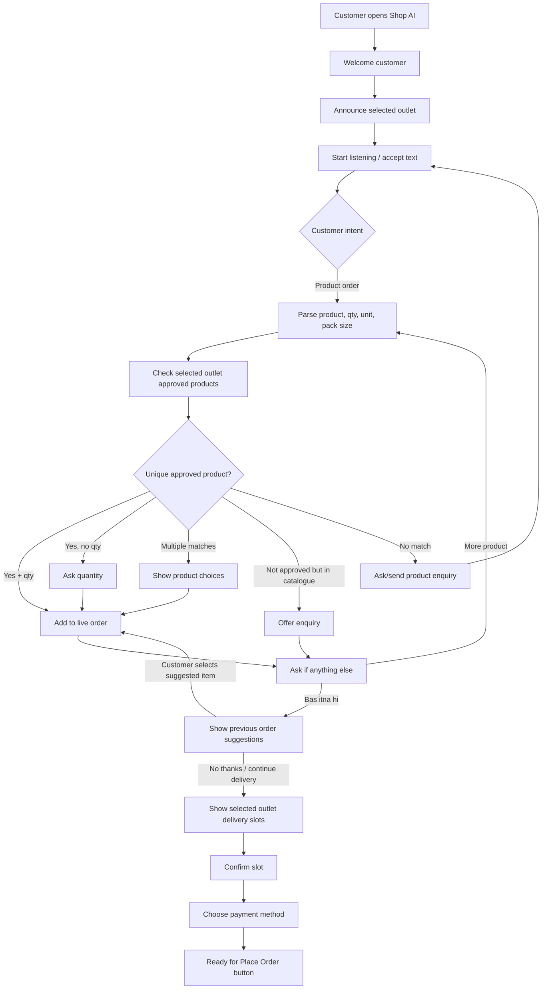
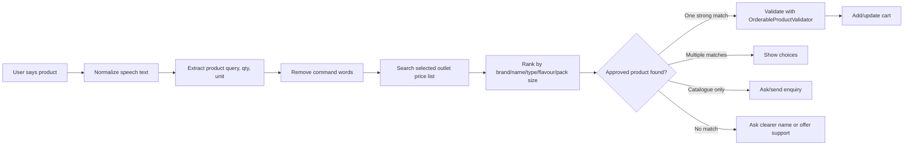

# Zonik AI Assistant

Zonik AI Assistant is a Laravel-based voice and chat ordering assistant for outlet-specific grocery ordering. It is designed to behave like a real ordering agent: it understands Hinglish/English product requests, checks only the selected outlet's approved price list, adds verified products to the live order, and then guides the customer through previous-order suggestions, delivery slot selection, payment method selection, and final checkout.

## What The AI Does

- Greets the customer and announces the currently selected outlet.
- Accepts voice or typed grocery orders.
- Understands mixed Hinglish/English commands such as `real apple juice add karo`, `bas itna hi`, `jo jo bole the add kardo`, and `no thanks continue delivery`.
- Uses Gemini for semantic understanding when needed, with deterministic Laravel fallbacks for common order flows.
- Uses ElevenLabs for speech output. Browser TTS is intentionally disabled.
- Checks products against the selected outlet's approved price list before adding anything.
- Handles exact product names, flavours, brands, pack sizes like `200ml wala`, and multiple products in one sentence.
- Prevents unsafe bulk actions like adding every catalogue product.
- Adds only verified suggestion cards when the customer says `jo jo bole the add kardo`.
- Shows previous-order suggestions before delivery when the customer finishes shopping.
- Lets the customer reject suggestions and continue to delivery slot selection.
- Sends unavailable catalogue products to enquiry flow instead of silently adding them.
- Keeps the live cart outlet-scoped.
- Confirms delivery to the selected outlet's saved address.
- Collects delivery slot and payment method before final order placement.

## Master Agent Contract

Zonik should feel like a human grocery ordering agent, but Laravel remains the authority for every real action.

- The customer can speak naturally in English, Hindi, Hinglish, Roman Hindi, short phrases, imperfect grammar, or voice-transcription mistakes.
- The assistant normalizes intent first, then uses existing Laravel product search, outlet checks, cart validation, checkout, delivery, payment, and enquiry flows.
- The assistant must not invent products, prices, stock, pack sizes, discounts, delivery slots, payment methods, order IDs, or previous purchases.
- Clear commands should be fast: local deterministic parsing is preferred for obvious product/cart/finish commands; Gemini is used for ambiguous language, general questions, context, and multi-item understanding.
- High-confidence verified match means fast action. Low-confidence or multiple possible matches means a short clarification.
- Product attributes and quantity are separate. `200ml wala` is a pack size, not quantity 200. `do 200ml wale` means quantity 2 of the 200ml variant.
- Brand, flavour, pack size, category, and variant may appear in any word order, such as `Real ka orange juice`, `orange juice Real wala`, or `1 litre Real orange juice ke do`.
- Context references like `ek aur`, `same wala`, `wahi`, `jo abhi bola tha`, and `haan wohi` should use the current conversation/cart context when it is unique.
- Corrections override earlier unconfirmed details: `apple nahi orange` means use orange, not both.
- Broken voice transcripts must never be repeated back in a loop; repeated words are collapsed before chat/TTS output.
- If an exact requested variant is not approved, the assistant should offer verified alternatives or ask to send an enquiry instead of pretending another variant is the same product.
- Finish phrases like `bas itna hi`, `aur kuch nahi`, `ho gaya`, and `done` mean shopping is complete; they must never cancel or clear the order.
- Suggestion bulk-add phrases like `jo jo bole the add kardo`, `haan sab add karo`, and `jo suggest kiya tha sab daal do` can add only the most recently shown verified suggestion cards, never the whole catalogue.
- Catalogue-only or unavailable outlet products must go through the enquiry/request flow instead of being silently added.
- Final order placement must stay on the existing checkout/place-order flow; voice alone must not bypass final validation.

## Main AI Flow



## Approved Product Check Flow

The assistant never trusts the AI model to add products directly. Every add action goes through outlet-approved product validation.



## Typical Timing Targets

These are expected targets on a normal production server. Actual time depends on hosting speed, database size, network latency, Gemini latency, and ElevenLabs credits/API response.

| Step | Normal target | Slow case | Notes |
| --- | ---: | ---: | --- |
| Page bootstrap and instant welcome text | 0.1-0.5 sec | 1 sec | Text renders before network voice finishes. |
| Welcome voice request | 1-4 sec | 8-12 sec | ElevenLabs can be slower or silent if credits/API are unavailable. |
| Browser speech capture start | 0.3-1 sec | 2 sec | Depends on mobile browser permission/state. |
| Speech-to-text / transcript processing | 0.5-2 sec | 4-8 sec | Browser speech is faster; server transcription depends on network. |
| Local intent detection | 0.05-0.2 sec | 0.5 sec | Handles common product/cart/finish commands without Gemini. |
| Gemini semantic understanding | 1-4 sec | 8-12 sec | Used only when local rules need semantic help. |
| Approved product lookup | 0.2-1.5 sec | 3-6 sec | Searches selected outlet price list and ranks matches. |
| Product validation before add | 0.1-0.5 sec | 1-2 sec | Uses backend validator and approved price. |
| Cart add/update | 0.1-0.5 sec | 1 sec | Writes cart quantity and amount. |
| Assistant reply + cart refresh | 0.2-1 sec | 2 sec | UI updates live order and speech response. |
| Previous-order suggestions | 0.3-1.5 sec | 3 sec | Uses recent order history and excludes cart items. |
| Delivery slot lookup | 0.2-1 sec | 2 sec | Uses selected outlet address/zone/holiday logic. |
| Payment options | 0.2-1 sec | 2 sec | Checks online/COD/credit availability. |

## Conversation Examples

### Direct Product Add

```text
User: real orange juice 1 ltr add karo
AI: Real Orange Juice, 1ltr cart mein add kar diya. Aur items batate jaiye; complete ho to "bas itna hi" boliye.
```

### Pack Size Must Not Become Quantity

```text
User: product name add kardo 200ml wala
AI behavior: Search for the 200ml variant, add quantity 1, not quantity 200.
```

### Finish Shopping And Suggestions

```text
User: bas itna hi chahiye
AI: Previous orders ke basis par suggestions dikhata hai.
User: no thanks continue delivery karo
AI: Suggestions reject karke delivery slot selection par le jata hai.
```

### Rainy Weather Suggestion And Bulk Add

```text
User: aaj barish ka mausam hai toh kya kya lena chahiye
AI: Tea/coffee, soup/Maggi, biscuits, ginger, besan/chilli jaise verified outlet products suggest karta hai.
User: jo jo bole the wo add kardo
AI: Sirf last shown suggestion cards ko quantity 1 ke saath cart mein add karta hai.
```

### Multiple Products In One Command

```text
User: real apple juice ek add karo aur real orange juice ek add karo
AI behavior: Dono products separately verify karke cart mein add karega.
```

### Contextual Follow Up

```text
User: Real orange juice ek add karo
AI: Real Orange Juice cart mein add kar diya. Aur kuch chahiye?
User: ek aur
AI behavior: Last verified cart item, Real Orange Juice, ki quantity one more se update karega.
```

### Correction

```text
User: Real apple juice ek... nahi orange juice ek
AI behavior: Final corrected product, Real Orange Juice, ko verify karega; apple juice add nahi karega.
```

## Important Safety Rules

- AI can understand intent, but backend validation decides product availability, price, and cart mutation.
- Products are added only from the selected outlet's approved price list.
- Catalogue-only products go to enquiry flow.
- `Add all` is allowed only for the last shown suggestion cards, never for the whole catalogue.
- Finish phrases like `bas itna hi` must never cancel or clear the order.
- Delivery always goes to the selected outlet's saved address.
- Order is not placed by voice alone; final placement requires the checkout/place-order action.

## Main Assistant Routes

| Route | Purpose |
| --- | --- |
| `GET /ai-assistant` | Mobile AI assistant screen |
| `GET /assistant/welcome` | Welcome text and selected outlet context |
| `POST /assistant/chat` | Main AI chat/order engine |
| `POST /assistant/speak` | Text-to-speech response |
| `POST /assistant/transcribe` | Voice transcription |
| `GET /assistant/products` | Product suggestions/search |
| `GET /assistant/cart` | Live order/cart state |
| `POST /assistant/cart-snapshot` | Persist cart snapshot in conversation |
| `POST /assistant/selection` | Product card selection/add flow |
| `POST /assistant/reorder` | Previous order repeat flow |
| `POST /assistant/checkout-data` | Checkout data handoff |

## Deployment Notes

After pulling updates on production, run:

```bash
composer install --no-dev --optimize-autoloader
php artisan optimize:clear
php artisan config:cache
php artisan route:cache
```

If `.env` was changed, always run:

```bash
php artisan optimize:clear
```

## Performance Notes

The approved-product check can feel slow if it falls through to Gemini or if the outlet has many products. The fastest path is:

```text
voice/text -> local intent -> outlet price-list search -> validator -> cart add
```

The slower path is:

```text
voice/text -> Gemini semantic intent -> outlet price-list search -> validator -> cart add
```

To keep the assistant fast, common product commands should stay covered by local deterministic rules, and Gemini should be used mainly for ambiguous language, multi-item parsing, or general questions.
